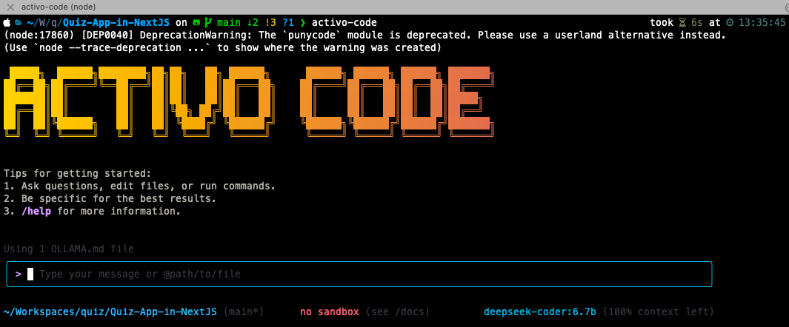

# Activo Code



Activo Code는 프라이버시를 중요시하는 명령줄 AI 워크플로우 도구입니다. [**Qwen Code**](https://github.com/QwenLM/qwen-code)에서 포크되어 로컬에서 호스팅되는 [Ollama](https://ollama.com) 모델과 함께 작동하도록 설계되었으며, 향상된 프라이버시와 데이터 주권을 제공합니다. 이 도구를 사용하면 코드와 데이터를 완전히 통제하면서 AI 지원 개발의 강력함을 누릴 수 있습니다.

## 🔒 프라이버시 & 데이터 주권 우선

**여러분의 코드는 절대 외부로 전송되지 않습니다.** 클라우드 기반 AI 도구와 달리, Activo Code는 모든 것을 로컬 Ollama 서버를 통해 처리하여 다음을 보장합니다:

- **완전한 프라이버시**: 외부 서비스로의 데이터 전송 없음
- **데이터 주권**: 모델과 처리에 대한 완전한 제어
- **오프라인 기능**: 모델 다운로드 후 인터넷 연결 없이 작업 가능
- **엔터프라이즈 준비**: 민감한 코드베이스와 에어갭 환경에 완벽

## ⚠️ 품질 고려사항

**중요:** 이 도구는 로컬 Ollama 모델을 사용하므로 클라우드 기반 모델과 다른 성능을 보일 수 있습니다:

- **작은 모델** (7B-14B 파라미터)은 대형 클라우드 모델보다 정확도가 낮을 수 있습니다
- **응답 품질**은 선택한 모델과 하드웨어에 따라 크게 달라집니다
- **복잡한 추론 작업**은 최적의 결과를 위해 더 큰 모델(70B+)이 필요할 수 있습니다
- **사용 사례 고려**: 특정 워크플로우에서 모델 적합성을 테스트하세요

## 주요 기능

- **코드 이해 & 편집** - 기존 컨텍스트 윈도우 제한을 넘어 대규모 코드베이스 쿼리 및 편집
- **워크플로우 자동화** - 풀 리퀘스트 처리 및 복잡한 리베이스와 같은 운영 작업 자동화
- **로컬 모델 지원** - Ollama 호환 모든 모델 지원 (Qwen, Llama, CodeLlama 등)
- **프라이버시 우선 아키텍처** - 모든 처리가 사용자의 인프라에서 발생

## 빠른 시작

### 사전 요구사항

1. **Node.js**: [Node.js 버전 20](https://nodejs.org/en/download) 이상 설치 필요
2. **Ollama 서버**: 선호하는 모델로 [Ollama](https://ollama.com) 설치 및 실행

### 설치

```bash
npm install -g activo-code
activo-code --version
```

어디서든 실행:

```bash
activo-code
```

또는 소스에서 설치:

```bash
git clone https://github.com/tcsenpai/ollama-code.git
cd activo-code
npm install
npm install -g .
```

### Ollama 서버 설정

1. **Ollama 설치** (아직 설치하지 않은 경우):
   ```bash
   curl -fsSL https://ollama.com/install.sh | sh
   ```

2. **코딩 모델 다운로드**:
   ```bash
   ollama pull qwen2.5-coder:14b  # 코드 작업에 권장
   # 또는
   ollama pull codellama:13b      # 대체 코딩 모델
   # 또는
   ollama pull llama3.1:8b        # 더 작고 빠른 옵션
   ```

3. **Ollama 서버 시작**:
   ```bash
   ollama serve
   ```

### 설정

Ollama 연결 구성 (도구는 기본적으로 로컬 Ollama를 자동 감지합니다):

```bash
# 선택사항: 커스텀 Ollama 서버
export OLLAMA_BASE_URL="http://localhost:11434/v1"
export OLLAMA_MODEL="qwen2.5-coder:14b"

# 또는 ~/.config/activo-code/config.json 생성:
{
  "baseUrl": "http://localhost:11434/v1",
  "model": "qwen2.5-coder:14b"
}
```

## 사용 예제

### 코드베이스 탐색

```sh
cd your-project/
activo-code
> 이 시스템 아키텍처의 주요 구성 요소를 설명해줘
```

### 코드 개발

```sh
> 이 함수를 가독성과 성능을 향상시키도록 리팩토링해줘
```

### 워크플로우 자동화

```sh
> 지난 7일간의 git 커밋을 기능과 팀원별로 분석해줘
```

```sh
> 이 디렉토리의 모든 이미지를 PNG 형식으로 변환해줘
```

## 인기 작업

### 새로운 코드베이스 이해하기

```text
> 핵심 비즈니스 로직 컴포넌트는 무엇인가요?
> 어떤 보안 메커니즘이 적용되어 있나요?
> 데이터 흐름은 어떻게 작동하나요?
```

### 코드 리팩토링 & 최적화

```text
> 이 모듈에서 최적화할 수 있는 부분은 무엇인가요?
> 이 클래스를 더 나은 디자인 패턴을 따르도록 리팩토링해주세요
> 적절한 에러 처리와 로깅을 추가해주세요
```

### 문서화 & 테스팅

```text
> 이 함수에 대한 포괄적인 JSDoc 주석을 생성해주세요
> 이 컴포넌트에 대한 단위 테스트를 작성해주세요
> API 문서를 생성해주세요
```

## 권장 모델

코딩 작업에 최적의 결과를 위해:

| 모델 | 크기 | 최적 용도 | 품질 | 속도 |
|-------|------|----------|---------|-------|
| `qwen2.5-coder:14b` | 14B | 코드 생성, 리팩토링 | ⭐⭐⭐⭐ | ⭐⭐⭐ |
| `codellama:13b` | 13B | 코드 완성, 디버깅 | ⭐⭐⭐ | ⭐⭐⭐ |
| `llama3.1:8b` | 8B | 일반 코딩, 빠른 응답 | ⭐⭐ | ⭐⭐⭐⭐ |
| `qwen2.5-coder:32b` | 32B | 복잡한 추론, 최고 품질 | ⭐⭐⭐⭐⭐ | ⭐⭐ |

## 프로젝트 구조

```
activo-code/
├── packages/           # 핵심 패키지
├── docs/              # 문서
├── examples/          # 예제 코드
└── tests/            # 테스트 파일
```

상세한 아키텍처 개요는 [ARCHITECTURE_KO.md](./ARCHITECTURE_KO.md)를 참조하세요.

## 개발 & 기여

프로젝트 기여 방법을 배우려면 [CONTRIBUTING.md](./CONTRIBUTING.md)를 참조하세요.

## 프라이버시 & 보안

- **로컬 처리**: 모든 AI 계산은 Ollama 서버에서 발생
- **텔레메트리 없음**: 외부로 사용 데이터 전송 안 함
- **코드 격리**: 소스 코드가 환경 밖으로 나가지 않음
- **감사 추적**: 모든 AI 상호작용에 대한 완전한 가시성

## 문제 해결

문제가 발생하면 [문제 해결 가이드](docs/troubleshooting.md)를 확인하세요.

일반적인 문제:
- **연결 거부됨**: Ollama가 실행 중인지 확인 (`ollama serve`)
- **모델을 찾을 수 없음**: 먼저 모델을 다운로드 (`ollama pull model-name`)
- **느린 응답**: 더 작은 모델 사용 또는 하드웨어 업그레이드 고려

## 감사의 말

이 프로젝트는 [**Qwen Code**](https://github.com/QwenLM/qwen-code)에서 포크되었으며, 원래 [Google Gemini CLI](https://github.com/google-gemini/gemini-cli)를 기반으로 합니다. 두 팀의 훌륭한 작업에 감사하고 인정합니다. 우리의 기여는 Ollama를 통한 프라이버시 우선 로컬 모델 통합에 중점을 둡니다.

## 라이선스

[LICENSE](./LICENSE)
